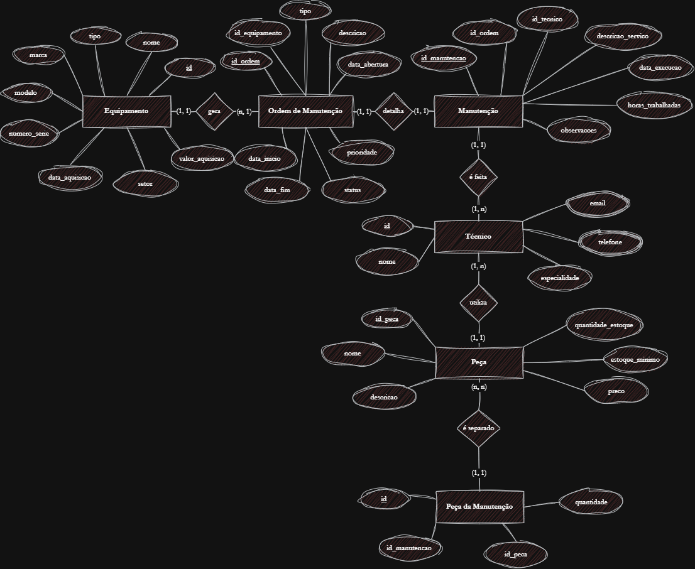
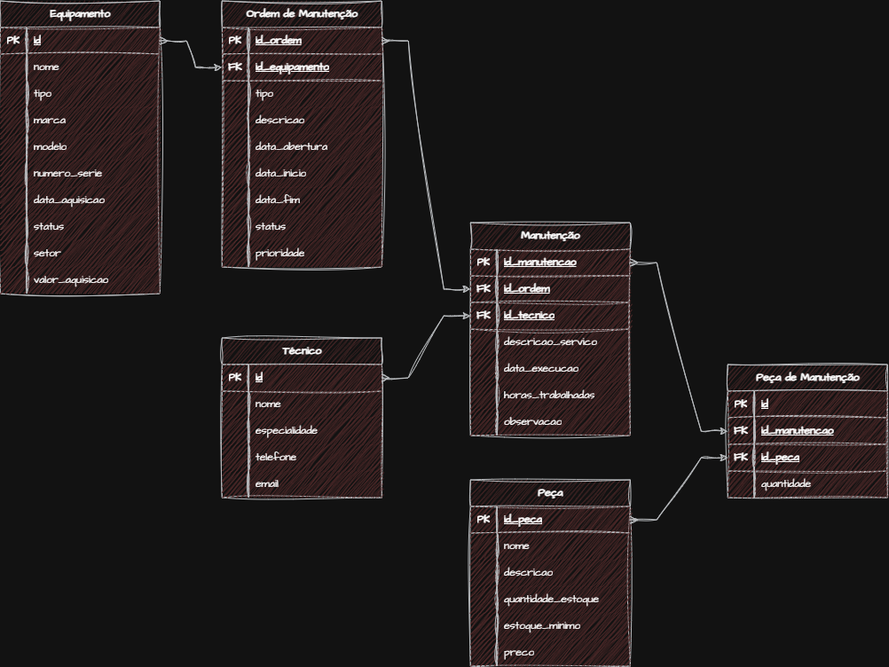

# VPS01 - Tema 04 - Manutenção de Equipamentos
Um banco de dados de manutenção de equipamentos em uma fábrica, onde o objetivo é controlar os equipamentos, seu histórico de manutenção, os técnicos responsáveis, peças utilizadas e as ordens de serviço.
## MER/DER Conceitual

## MER/DER Lógico

## Dicionário de Dados
| Tabela               | Campo                | Tipo de Dado     | Descrição                                  |
| :------------------- | :------------------- | :--------------- | :----------------------------------------- |
| `equipamento`        | `id`                 | `INT`            | Identificador único do equipamento.        |
| `equipamento`        | `nome`               | `VARCHAR(100)`   | Designação do equipamento.                 |
| `equipamento`        | `tipo`               | `VARCHAR(50)`    | Categoria ou tipo de equipamento.          |
| `equipamento`        | `marca`              | `VARCHAR(50)`    | Fabricante do equipamento.                 |
| `equipamento`        | `modelo`             | `VARCHAR(50)`    | Modelo específico.                         |
| `equipamento`        | `numero_serie`       | `VARCHAR(50)`    | Número de série de identificação.          |
| `equipamento`        | `data_aquisicao`     | `DATE`           | Data de aquisição.                         |
| `equipamento`        | `status`             | `VARCHAR(30)`    | Estado atual (ex: operacional).            |
| `equipamento`        | `setor`              | `VARCHAR(50)`    | Localização/setor na fábrica.              |
| `equipamento`        | `valor_aquisicao`    | `DECIMAL(12, 2)` | Custo de compra do equipamento.            |
| `ordem_manutencao`   | `id_ordem`           | `INT`            | Identificador único da ordem.              |
| `ordem_manutencao`   | `id_equipamento`     | `INT`            | Equipamento associado à ordem.             |
| `ordem_manutencao`   | `tipo`               | `VARCHAR(30)`    | Tipo de manutenção (preventiva/corretiva). |
| `ordem_manutencao`   | `descricao`          | `TEXT`           | Descrição detalhada do problema.           |
| `ordem_manutencao`   | `data_abertura`      | `DATETIME`       | Data e hora de abertura.                   |
| `ordem_manutencao`   | `data_inicio`        | `DATETIME`       | Data de início dos trabalhos.              |
| `ordem_manutencao`   | `data_fim`           | `DATETIME`       | Data de encerramento.                      |
| `ordem_manutencao`   | `status`             | `VARCHAR(30)`    | Estado da ordem (ex: concluída).           |
| `ordem_manutencao`   | `prioridade`         | `VARCHAR(20)`    | Nível de urgência (ex: alta, média).       |
| `tecnico`            | `id`                 | `INT`            | Identificador único do técnico.            |
| `tecnico`            | `nome`               | `VARCHAR(100)`   | Nome completo do técnico.                  |
| `tecnico`            | `especialidade`      | `VARCHAR(50)`    | Área de especialização.                    |
| `email`              | `id`                 | `INT`            | Identificador único do e-mail.             |
| `email`              | `id_tecnico`         | `INT`            | Técnico proprietário do e-mail.            |
| `email`              | `email`              | `VARCHAR(100)`   | Endereço de correio eletrónico.            |
| `telefone`           | `id`                 | `INT`            | Identificador único do telefone.           |
| `telefone`           | `id_tecnico`         | `INT`            | Técnico proprietário do telefone.          |
| `telefone`           | `telefone`           | `VARCHAR(20)`    | Número de telefone/telemóvel.              |
| `peca`               | `id_peca`            | `INT`            | Identificador único da peça.               |
| `peca`               | `nome`               | `VARCHAR(100)`   | Nome da peça.                              |
| `peca`               | `descricao`          | `TEXT`           | Detalhes adicionais.                       |
| `peca`               | `quantidade_estoque` | `INT`            | Quantidade atual em stock.                 |
| `peca`               | `estoque_minimo`     | `INT`            | Limite mínimo para alertas.                |
| `peca`               | `preco`              | `DECIMAL(10, 2)` | Preço unitário.                            |
| `manutencao`         | `id_manutencao`      | `INT`            | Identificador único da execução.           |
| `manutencao`         | `id_ordem`           | `INT`            | Ordem de manutenção associada.             |
| `manutencao`         | `id_tecnico`         | `INT`            | Técnico responsável pelo serviço.          |
| `manutencao`         | `descricao_servico`  | `TEXT`           | Relatório do serviço prestado.             |
| `manutencao`         | `data_execucao`      | `DATE`           | Data de realização.                        |
| `manutencao`         | `horas_trabalhadas`  | `DECIMAL(5, 2)`  | Tempo gasto no trabalho.                   |
| `manutencao`         | `observacoes`        | `TEXT`           | Notas adicionais.                          |
| `peca_da_manutencao` | `id`                 | `INT`            | Identificador único da associação.         |
| `peca_da_manutencao` | `id_manutencao`      | `INT`            | Manutenção onde a peça foi usada.          |
| `peca_da_manutencao` | `id_peca`            | `INT`            | Peça utilizada.                            |
| `peca_da_manutencao` | `quantidade`         | `INT`            | Quantidade da peça aplicada.               |
## Dados de teste
- [Equipamento](equipamento.csv)
- [Manutenção](manutencao.csv)
- [Ordem da Manutenção](ordem_manutencao.csv)
- [Peça](peca.csv)
- [Peça da Manutenção](peca_manutencao.csv)
## Código do DDL
```sql
    drop database if exists manutencao_equipamentos;

    create database manutencao_equipamentos;

    use manutencao_equipamentos;

    create table equipamento (
        id int primary key auto_increment,
        nome varchar(100) not null,
        tipo varchar(50) not null,
        marca varchar(50),
        modelo varchar(50),
        numero_serie varchar(50) unique not null,
        data_aquisicao date default(curdate()),
        status varchar(30) not null,
        setor varchar(50) not null,
        valor_aquisicao decimal(12, 2)
    );

    create table ordem_manutencao (
        id_ordem int primary key auto_increment,
        id_equipamento int not null,
        tipo varchar(30) not null,
        descricao text not null,
        data_abertura datetime default(curdate()) not null,
        data_inicio datetime default(curdate()),
        data_fim datetime default(curdate()),
        status varchar(30) not null,
        prioridade varchar(20) not null
    );

    create table tecnico (
        id int primary key auto_increment,
        nome varchar(100) not null,
        especialidade varchar(50) not null
    );

    create table email(
        id int primary key auto_increment,
        id_tecnico int not null,
        email varchar(100) not null
    );

    create table telefone(
        id int primary key auto_increment,
        id_tecnico int not null,
        telefone varchar(20) not null
    );

    create table peca (
        id_peca int primary key auto_increment,
        nome varchar(100) not null,
        descricao text,
        quantidade_estoque int not null default 0,
        estoque_minimo int not null default 0,
        preco decimal(10, 2) not null
    );

    create table manutencao (
        id_manutencao int primary key auto_increment,
        id_ordem int not null,
        id_tecnico int not null,
        descricao_servico text not null,
        data_execucao date default(curdate()) not null,
        horas_trabalhadas decimal(5, 2) not null,
        observacoes text
    );

    create table peca_da_manutencao (
        id int primary key auto_increment,
        id_manutencao int not null,
        id_peca int not null,
        quantidade int not null
    );

    alter table
        ordem_manutencao
    add
        constraint possui foreign key (id_equipamento) references equipamento(id);

    alter table
        manutencao
    add
        constraint descreve foreign key (id_ordem) references ordem_manutencao(id_ordem);

    alter table
        manutencao
    add
        constraint faz foreign key (id_tecnico) references tecnico(id);

    alter table
        peca_da_manutencao
    add
        constraint separa foreign key (id_manutencao) references manutencao(id_manutencao);

    alter table
        peca_da_manutencao
    add
        constraint contem foreign key (id_peca) references peca(id_peca);

    alter table
        email
    add
        constraint tem foreign key (id_tecnico) references tecnico(id);

    alter table
        telefone
    add
        constraint obtem foreign key (id_tecnico) references tecnico(id);
```
## Código do DML
```sql
    use manutencao_equipamentos;

    insert into equipamento (nome, tipo, marca, modelo, numero_serie, data_aquisicao, status, setor, valor_aquisicao) values
    ('Prensa Hidráulica 50T', 'Prensa', 'Schuler', 'PH-50', 'SN-2021-001', '2021-03-15', 'Operacional', 'Linha de Estampagem', 120000.00),
    ('Torno CNC 4 Eixos', 'Torno', 'Mazak', 'QuickTurn 250', 'SN-2022-412', '2022-07-10', 'Operacional', 'Usinagem', 250000.00),
    ('Robô de Solda MIG', 'Robô', 'KUKA', 'KR 16', 'SN-2020-891', '2020-11-05', 'Em Manutenção', 'Soldagem', 180000.00),
    ('Compressor de Ar Parafuso', 'Compressor', 'Atlas Copco', 'GA 37', 'SN-2019-332', '2019-01-20', 'Operacional', 'Utilidades', 45000.00),
    ('Ponte Rolante 10t', 'Ponte Rolante', 'WEG', 'PR-10T', 'SN-2018-105', '2018-05-12', 'Operacional', 'Logística/Expedição', 95000.00);

    insert into tecnico ( nome, especialidade) values
    ('Carlos Silva', 'Mecânica Geral'),
    ('Ana Souza', 'Automação e Robótica'),
    ('Marcos Oliveira', 'Sistemas Hidráulicos'),
    ('Juliana Lima', 'Elétrica Industrial');

    insert into telefone (id_tecnico, telefone) values
    (1, '(11) 98765-4321'),
    (1, '(11) 3333-4444'),
    (2, '(11) 97123-4567'),
    (3, '(11) 96543-2109'),
    (4, '(11) 99887-6655'),
    (4, '(11) 2222-1111');

    insert into email (id_tecnico, email) values
    (1, 'carlos.silva@fabrica.com'),
    (1, 'carlos.mecanica@fabrica.com'),
    (2, 'ana.souza@fabrica.com'),
    (3, 'marcos.oliveira@fabrica.com'),
    (4, 'juliana.lima@fabrica.com'),
    (4, 'juliana.eletrica@fabrica.com');

    insert into peca (nome, descricao, quantidade_estoque, estoque_minimo, preco) values
    ('Filtro de Óleo Hidráulico', 'Filtro de alta pressão 10 micras', 15, 5, 150.00),
    ('Óleo Hidráulico AW 68 (Balde 20L)', 'Lubrificante mineral anti-desgaste', 8, 3, 320.00),
    ('Correia em V B-48', 'Correia de transmissão industrial', 25, 10, 45.00),
    ('Placa de Interface KUKA', 'Módulo de E/S para robô de solda', 2, 1, 2500.00),
    ('Cabo de Aço 1/2 Pol (Metro)', 'Cabo de aço para ponte rolante', 120, 30, 85.00);

    insert into ordem_manutencao (id_equipamento, tipo, descricao, data_abertura, data_inicio, data_fim, status, prioridade) values
    (3, 'Corretiva', 'Falha no eixo do manipulador e erro de comunicação', '2026-05-10 08:30:00', '2026-05-10 09:00:00', '2026-05-10 14:30:00', 'Concluída', 'Alta'),
    (1, 'Preventiva', 'Troca de óleo do sistema hidráulico e limpeza de filtros', '2026-05-12 07:00:00', '2026-05-12 08:00:00', '2026-05-12 11:00:00', 'Concluída', 'Média'),
    (4, 'Preventiva', 'Substituição de elemento filtrante e verificação de correias', '2026-05-15 08:00:00', '2026-05-15 08:30:00', '2026-05-15 10:00:00', 'Concluída', 'Baixa'),
    (2, 'Corretiva', 'Vibração excessiva no fuso principal durante usinagem', '2026-05-18 13:00:00', '2026-05-18 13:30:00', null, 'Em Andamento', 'Alta'),
    (5, 'Preventiva', 'Inspeção geral de cabos de aço e freios da ponte rolante', '2026-05-20 06:00:00', null, null, 'Aberta', 'Média');

    insert into manutencao (id_ordem, id_tecnico, descricao_servico, data_execucao, horas_trabalhadas, observacoes) values
    (1, 2, 'Substituição da placa de interface e reconfiguração dos parâmetros de rede do robô.', '2026-05-10', 5.5, 'Teste realizado com sucesso após o reparo.'),
    (2, 3, 'Substituído o óleo hidráulico completo e trocados os elementos filtrantes da prensa.', '2026-05-12', 3.0, 'Descarte do óleo realizado conforme norma ambiental.'),
    (3, 1, 'Troca de correias do compressor e limpeza dos radiadores de ar.', '2026-05-15', 1.5, 'Equipamento operando com menor nível de ruído.');

    insert into peca_da_manutencao (id_manutencao, id_peca, quantidade) values
    (1, 4, 1),
    (2, 1, 2),
    (2, 2, 2),
    (3, 3, 2);
```
